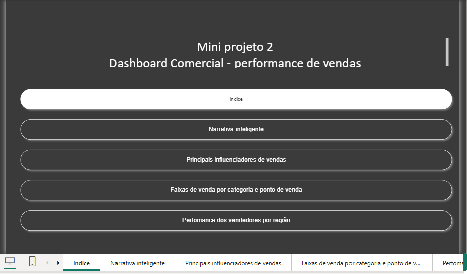
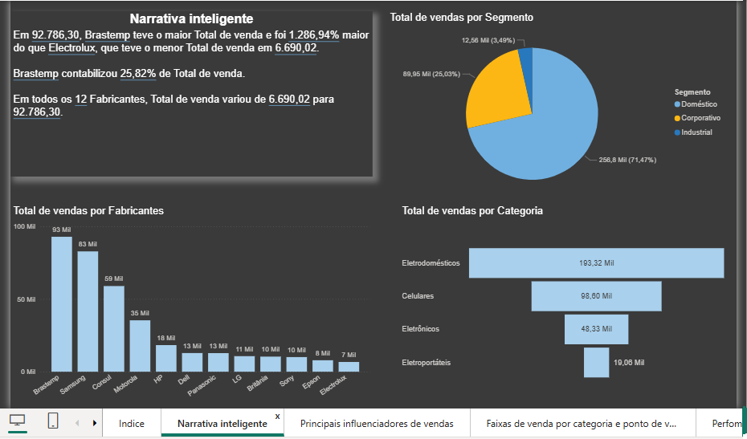
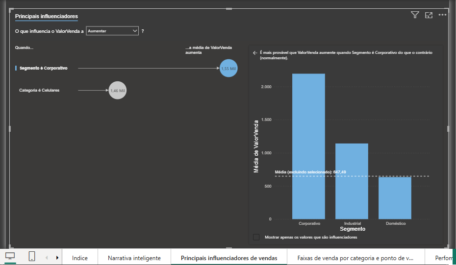
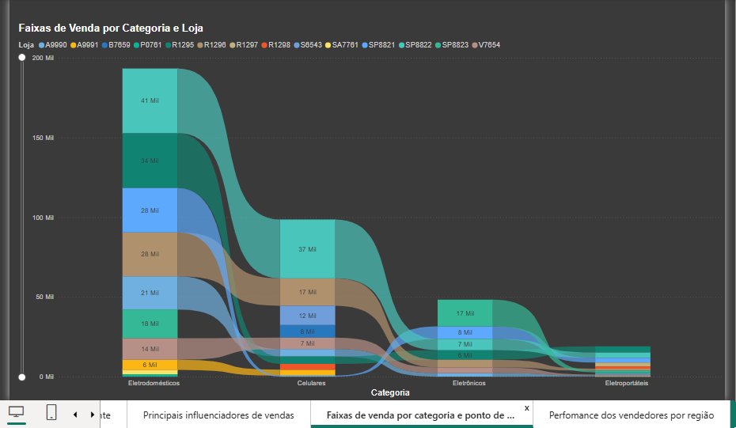
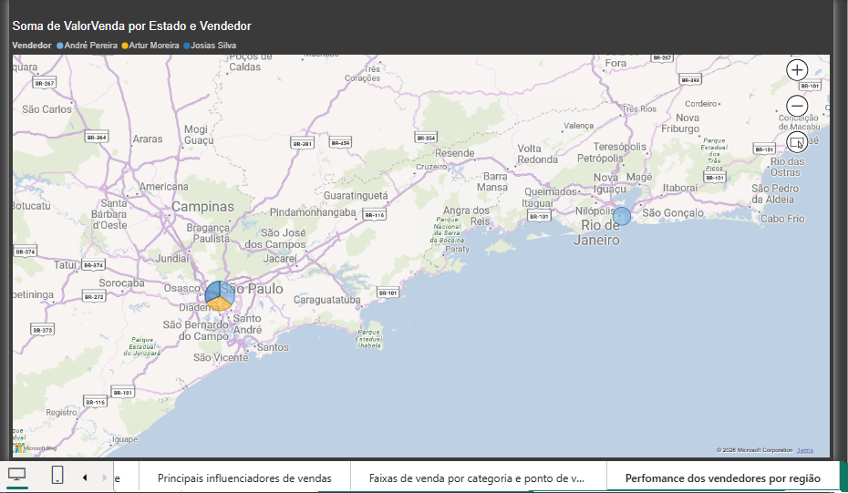

# 📊 Dashboard Comercial - Performance de Vendas

## 📖 Sobre o projeto

Este projeto consiste em um dashboard comercial desenvolvido no **Power BI Desktop** com o objetivo de analisar o desempenho das vendas de uma empresa fictícia, permitindo acompanhar indicadores estratégicos, identificar padrões de consumo e apoiar a tomada de decisões.

O relatório foi desenvolvido utilizando recursos avançados do Power BI, explorando diferentes tipos de visualizações e funcionalidades de Business Intelligence para gerar insights sobre fabricantes, categorias, segmentos, vendedores e regiões de atuação.

---

## 🎯 Objetivos

- Analisar o desempenho das vendas por fabricante.
- Identificar categorias com maior faturamento.
- Avaliar a distribuição das vendas por segmento.
- Descobrir fatores que influenciam o aumento das vendas.
- Comparar a performance dos vendedores por região.
- Demonstrar recursos avançados do Power BI.

---

## 📊 Páginas do Dashboard

### 🏠 Índice

Página inicial para navegação entre todas as análises do relatório.

---

### 🧠 Narrativa Inteligente

Utilização do recurso **Smart Narrative** do Power BI para gerar automaticamente uma interpretação dos principais indicadores do relatório.

Nesta página também são apresentados:

- Total de vendas por fabricante
- Total de vendas por categoria
- Distribuição das vendas por segmento
- Resumo automático dos principais resultados

---

### 📈 Principais Influenciadores

Análise utilizando o visual **Key Influencers**, identificando quais fatores possuem maior impacto sobre o valor das vendas.

Entre os fatores analisados estão:

- Segmento
- Categoria
- Média do valor das vendas

---

### 🔄 Fluxo das Vendas por Categoria

Dashboard utilizando gráfico do tipo **Sankey**, permitindo visualizar o fluxo das vendas entre:

- Categorias
- Lojas
- Volume de vendas

Esse tipo de visual facilita a identificação da concentração das vendas e do comportamento entre categorias e pontos de venda.

---

### 🗺️ Performance dos Vendedores por Região

Visualização geográfica das vendas utilizando mapa.

Permite analisar:

- Distribuição das vendas por estado
- Desempenho individual dos vendedores
- Concentração das vendas por localização

---

## 🛠️ Ferramentas Utilizadas

- Power BI Desktop
- Power Query
- DAX
- Modelagem de Dados
- Smart Narrative
- Key Influencers
- Sankey Chart
- Map Visual

---

## 📌 Principais Indicadores

- Valor Total de Vendas
- Vendas por Fabricante
- Vendas por Categoria
- Vendas por Segmento
- Performance dos Vendedores
- Distribuição Geográfica
- Influenciadores de Venda

---

## 💡 Principais Insights

Durante a construção do dashboard foi possível identificar:

- Fabricantes com maior participação no faturamento.
- Categorias responsáveis pelo maior volume de vendas.
- Segmentos que apresentam maior ticket médio.
- Variáveis que influenciam diretamente o aumento das vendas.
- Distribuição geográfica do desempenho comercial.

---

## 📂 Estrutura do Projeto

```
Dashboard-Comercial-PowerBI/
│
├── Dashboard Comercial.pbix
├── README.md
└── screenshots/
    ├── indice.png
    ├── narrativa.png
    ├── influenciadores.png
    ├── sankey.png
    └── mapa.png
```

---

## 📷 Dashboard

### Índice



### Narrativa Inteligente



### Principais Influenciadores



### Fluxo das Vendas



### Performance por Região



---

## 🚀 Como visualizar

1. Faça o download do arquivo `.pbix`.
2. Abra utilizando o **Power BI Desktop**.
3. Navegue entre as páginas do relatório.

---

## 👨‍💻 Autor

**José Rafael Santos Pereira**

Analista de Sistemas | Power BI | SQL | Python | Flutter | Business Intelligence

GitHub: https://github.com/ZeRafaSp/

LinkedIn: https://www.linkedin.com/in/rafaelsantospereirarsp/
